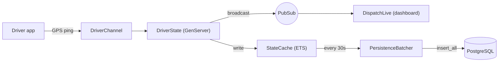
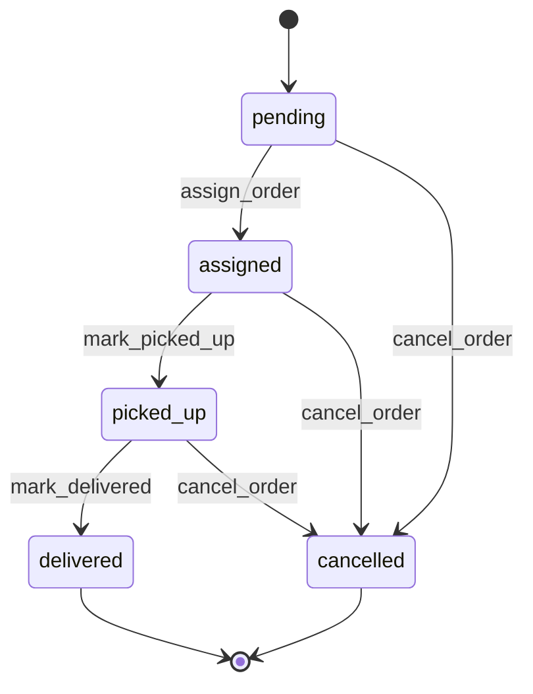

# FleetPulse

**High-frequency driver tracking & dispatch engine for last-mile logistics.**

FleetPulse keeps live driver location in memory and streams it to an operator
dashboard over WebSockets — no database write per GPS ping, no separate SPA. It
is built on Elixir/OTP so a single node can hold thousands of concurrent driver
connections, each backed by its own lightweight process.

- **Telemetry ingestion** — drivers push GPS over a Phoenix Channel every few seconds.
- **In-memory fleet state** — one GenServer per driver, indexed by a Registry, cached in ETS.
- **Periodic persistence** — location history is batched to PostgreSQL for audit, not written per ping.
- **Proximity dispatch** — "which drivers are within N km?" answered from memory, with an atomic claim so no two orders grab the same driver.
- **Live dashboard** — a Phoenix LiveView map that updates itself from PubSub, with buffered rendering.

---

## Table of contents

- [Requirements](#requirements)
- [Getting started](#getting-started)
- [Architecture](#architecture)
- [Domain contexts](#domain-contexts)
- [How the moving parts work](#how-the-moving-parts-work)
- [Data model](#data-model)
- [Real-time interfaces](#real-time-interfaces)
- [Authentication](#authentication)
- [Strict typing & quality gate](#strict-typing--quality-gate)
- [Testing](#testing)
- [Configuration](#configuration)
- [Mix command reference](#mix-command-reference)
- [Project layout](#project-layout)
- [Known limitations (V1)](#known-limitations-v1)
- [Out of scope](#out-of-scope)

---

## Requirements

| Tool | Version |
| :--- | :--- |
| Elixir | `~> 1.17` (developed on 1.20.2) |
| Erlang/OTP | 26+ (developed on OTP 29) |
| PostgreSQL | 14+ |

Any PostgreSQL reachable at `localhost:5432` with role/password `postgres`/`postgres`
works. A container is the simplest option:

```bash
docker run --name fleet_pulse-db -e POSTGRES_PASSWORD=postgres \
  -p 5432:5432 -d postgres:14-alpine
```

Adjust credentials in `config/dev.exs` and `config/test.exs` if yours differ.

---

## Getting started

```bash
mix setup            # deps.get + ecto.create + migrate + seed + assets
mix phx.server       # or: iex -S mix phx.server
```

Then open **http://localhost:4000/dispatch** and log in with the seeded admin:

| Email | Password |
| :--- | :--- |
| `admin@fleetpulse.local` | `changeme123456` |

`mix setup` runs `priv/repo/seeds.exs`, which creates that admin if it does not
already exist. **Change the password before any real deployment.**

---

## Architecture

Phoenix is treated strictly as the delivery layer. All business logic lives in
contexts under `lib/fleet_pulse/`; the web layer under `lib/fleet_pulse_web/`
only parses requests and maps responses.

### Telemetry flow



A GPS ping only rewrites a map inside one process and fans out over PubSub. The
database is touched on a timer, in batches — never on the hot path.

### Why in-memory

At the target scale (10k drivers pinging every ~5s = ~2k writes/s) a
row-per-ping design exhausts the connection pool. FleetPulse holds current state
in a per-driver process and an ETS cache, and persists a periodic **sample** of
positions for audit. Dispatch and geofencing read that live memory, not the
database.

---

## Domain contexts

| Context | Responsibility |
| :--- | :--- |
| `FleetPulse.Tracking` | Telemetry ingestion, driver processes, ETS cache, persistence, proximity queries. |
| `FleetPulse.Dispatch` | Order intake, driver assignment (atomic claim), the order lifecycle state machine. |
| `FleetPulse.Accounts` | Dispatch-operator (admin) identities and authentication. |

Everything outside a context talks to it through its public façade
(`Tracking`, `Dispatch`, `Accounts`) — never directly to a GenServer, Registry,
ETS table, or Repo.

---

## How the moving parts work

### Per-driver process & rehydration

Each active driver is a `DriverState` GenServer, registered in `DriverRegistry`
by driver id and started on demand by `DriverSupervisor` (a `DynamicSupervisor`).
On start it rehydrates in `handle_continue` — **ETS first, database as fallback**:

- Process crash (common) → replacement rehydrates from `StateCache` (ETS), zero queries.
- Node restart (rare) → ETS is empty, so `Snapshot` reads the last known state from PostgreSQL.

`restart: :transient` means a driver that logs out normally is not restarted; a
crash is. `terminate/2` (with `trap_exit`) evicts the cache entry on a clean
stop but keeps it on a crash — that entry is the recovery path.

### Persistence batching

`PersistenceBatcher` sweeps the ETS cache on an interval and writes each driver's
latest position with `Repo.insert_all/3`. Because `insert_all` bypasses
changesets, the `location_pings` table's `CHECK` constraints are the real guard,
and inbound telemetry is validated at the boundary by `Tracking.Telemetry`
before it can ever enter the cache. A unique index on `(driver_id, recorded_at)`
makes repeated flushes idempotent, and a DB error is caught at the I/O boundary
so the batcher never crash-loops.

### Idle reaper

Driver processes deliberately outlive their WebSocket (a reconnect keeps a warm
position instead of re-reading Postgres). `IdleReaper` stops any `:offline`
driver untouched for longer than `idle_after_ms`, so abandoned processes and
their stale positions do not accumulate. The decision is made **inside** each
process against its own current state, so a driver that reconnects mid-sweep is
never killed on a stale reading.

### Proximity queries

`Tracking.nearby/3` answers "drivers within `radius_km` of a point" entirely from
memory. `Geo.bounding_box/2` discards the vast majority with four float
comparisons (no trigonometry); only survivors pay for `Geo.distance_km/2`
(haversine). The box is always widened, never narrowed, near the poles and the
antimeridian — it is an optimisation that must never drop a true match. Results
can be filtered by `status` and `min_capacity_kg`.

### Dispatch & the atomic claim

`Dispatch.assign_order/2` finds eligible drivers with `nearby/3`, then **claims**
the nearest one before writing the order. The claim is a single message to the
driver's `DriverState` process, which flips `:online → :busy` only if still
online. Because the actor serialises messages, two orders racing for the same
driver resolve to exactly one winner; the loser falls through to the next
candidate. Claim precedes persistence, and a failed write releases the claim, so
a driver is never stranded `:busy` for an order that does not exist.

### Order lifecycle



Transitions are data (a map of legal moves); anything not listed is refused as
`{:error, :invalid_transition}`. Driver-initiated moves (`mark_picked_up`,
`mark_delivered`) verify ownership in the domain, not the channel. Reaching a
terminal state frees the driver back to `:online`.

---

## Data model

| Table | Key columns | Notable constraints |
| :--- | :--- | :--- |
| `drivers` | name, phone, vehicle_plate, capacity_kg, status, active | unique phone & plate; `capacity_kg` 0–5000; status enum `online/busy/offline` |
| `location_pings` | driver_id, latitude, longitude, speed_kmh, bearing_deg, recorded_at | append-only; lat/lng/speed/bearing range checks; unique `(driver_id, recorded_at)`; FK `on_delete: :restrict` |
| `orders` | pickup/dropoff coords, weight_kg, status, driver_id, assigned_at | status enum; coord range checks; a driverless order must be `pending`/`cancelled` |
| `admins` | email, hashed_password | unique email; bcrypt hash |

Every range and enum is enforced by a database `CHECK` constraint in addition to
the changeset — the constraint is the last line that no code path (including
`insert_all`, seeds, or manual SQL) can bypass. `recorded_at` uses
microsecond precision so high-frequency pings never collide.

---

## Real-time interfaces

### Driver WebSocket (mobile app)

Connect to the `/driver` socket with a signed token:

```
ws://<host>/driver/websocket?token=<DriverToken>
```

A token is minted server-side with `FleetPulseWeb.DriverToken.sign(driver_id)`
(7-day expiry). Join the topic for your own driver id:

| Direction | Event | Payload |
| :--- | :--- | :--- |
| join | `driver:<id>` | — (must match the authenticated driver) |
| push → server | `ping` | `latitude`, `longitude`, `recorded_at` (ISO8601), optional `speed_kmh`, `bearing_deg` |
| push → server | `status` | `status` (`"online"` / `"busy"` / `"offline"`) |
| push → server | `pickup` | `order_id` |
| push → server | `delivered` | `order_id` |
| server → device | `order_assigned` | order details |
| server → device | `order_updated` | order details (e.g. cancelled by dispatcher) |

Identity always comes from the authenticated socket, never from the payload;
malformed telemetry is rejected as a reply, not a crash.

### Dispatch dashboard (LiveView)

`GET /dispatch` (auth required) renders a live fleet table. It reads the current
fleet from ETS once on mount, then keeps current from PubSub. Updates are
buffered in a map keyed by driver id and flushed on a timer (default 500 ms),
which both caps the render rate and deduplicates rapid pings.

---

## Authentication

Admin login is session-based, with the security details that matter:

- **bcrypt** password hashing; the plaintext lives only in a virtual changeset field and is never persisted.
- **Timing-attack resistant** — a login for a non-existent email still spends one bcrypt verification, so response time cannot enumerate valid emails.
- **Session fixation resistant** — the session id is renewed on both login and logout.
- **Layered gate** — `/dispatch` is protected by both a router plug (`require_authenticated_admin`) and a LiveView `on_mount` hook.

The signed cookie stores only the admin id; the record is re-loaded from the
database each request, so a deleted admin loses access immediately.

---

## Strict typing & quality gate

This codebase enforces static typing discipline despite Elixir being dynamic:

- **`@type` / `@spec` on every public function.** Credo's `Readability.Specs` check (enabled in `.credo.exs`) fails the build otherwise.
- **Dialyzer with strict flags** (`mix.exs`): `error_handling`, `extra_return`, `missing_return`, `unmatched_returns`, `underspecs`, `unknown`. A shared vocabulary of domain types lives in `FleetPulse.Types`.
- **Shared PLTs** cached under `priv/plts/` (git-ignored).

Everything is gated by a single command:

```bash
mix precommit
```

which runs `compile --warnings-as-errors`, `deps.unlock --unused`, `format`,
`credo --strict`, `dialyzer`, and `test` — in `MIX_ENV=test`, so `test/support`
is type-checked too.

---

## Testing

The suite follows an Elixir-shaped pyramid — a fat integration middle, because
`Ecto.Adapters.SQL.Sandbox` makes DB-backed tests fast and isolated, so mocking
the Repo would only hide real behaviour.

| Layer | What | Async |
| :--- | :--- | :--- |
| Unit | Pure functions: telemetry validation, changesets, geodesy, topic names, token verification | ✅ |
| Integration | Contexts + OTP processes + real DB: tracking lifecycle, batcher, dispatch, reaper | ❌ |
| End-to-end | Channels & LiveView over the full stack | ❌ |

Integration tests are **non-async** on purpose: rehydration runs inside the
`DriverState` process, which needs the sandbox's shared mode. Concurrency
guarantees (the atomic claim) are proven by tests that launch many processes at
one driver and assert exactly one winner.

```bash
mix test
```

---

## Configuration

Runtime knobs (see `config/config.exs`, overridden in `config/test.exs` where noted):

| Setting | Default | Notes |
| :--- | :--- | :--- |
| `PersistenceBatcher` `interval_ms` | `30_000` | how often positions are flushed to Postgres |
| `PersistenceBatcher` `chunk_size` | `1_000` | rows per `insert_all` (keeps under the bind-parameter limit) |
| `IdleReaper` `interval_ms` | `60_000` | how often idle drivers are swept |
| `IdleReaper` `idle_after_ms` | `900_000` | offline-and-quiet threshold (15 min) |
| `DispatchLive` `flush_interval_ms` | `500` | dashboard render/coalesce interval |

The batcher and reaper are **disabled in `:test`** so their timers cannot race
the suite; tests drive `flush_now/0` and `reap_now/0` explicitly.

---

## Mix command reference

| Command | Purpose |
| :--- | :--- |
| `mix setup` | Install deps, create & migrate DB, seed, build assets |
| `mix phx.server` | Start the server (`iex -S mix phx.server` for a shell) |
| `mix test` | Run the test suite |
| `mix precommit` | Full gate: compile-as-errors, format, credo, dialyzer, test |
| `mix dialyzer` | Type analysis only |
| `mix credo --strict` | Lint + `@spec` enforcement |
| `mix ecto.reset` | Drop, recreate, migrate, seed |

---

## Project layout

```
lib/fleet_pulse/
├── types.ex                     # shared domain type vocabulary
├── tracking.ex                  # Tracking context (façade)
├── tracking/
│   ├── driver.ex                # driver schema (PODO)
│   ├── location_ping.ex         # append-only telemetry schema
│   ├── telemetry.ex             # pure validation/normalisation of GPS payloads
│   ├── driver_state.ex          # per-driver GenServer (live state)
│   ├── driver_registry.ex       # typed Registry wrapper (id → pid)
│   ├── driver_supervisor.ex     # DynamicSupervisor of driver processes
│   ├── state_cache.ex           # ETS cache of live state
│   ├── snapshot.ex              # cold rehydration from PostgreSQL
│   ├── persistence_batcher.ex   # periodic batched persistence
│   ├── idle_reaper.ex           # stops abandoned processes
│   ├── geo.ex                   # haversine + bounding box
│   ├── events.ex                # tracking PubSub topics/events
│   └── supervisor.ex            # tracking subsystem supervision subtree
├── dispatch.ex                  # Dispatch context (façade)
├── dispatch/
│   ├── order.ex                 # order schema + lifecycle statuses
│   └── events.ex                # dispatch PubSub topics/events
├── accounts.ex                  # Accounts context (façade)
└── accounts/admin.ex            # admin schema + password hashing

lib/fleet_pulse_web/
├── channels/
│   ├── driver_socket.ex         # authenticated driver socket
│   ├── driver_channel.ex        # telemetry ingress + lifecycle events
│   └── driver_token.ex          # signed driver bearer tokens
├── live/dispatch_live.ex        # real-time dispatch dashboard
├── admin_auth.ex                # auth plugs + LiveView on_mount
└── controllers/                 # admin session (login/logout)
```

---

## Known limitations (V1)

Deliberate trade-offs, safe to revisit later:

- **No server-side session store** — an admin session lives until its cookie expires and cannot be revoked remotely. A token table would add remote logout.
- **`capacity_kg` is a snapshot** — copied into memory at rehydration; a vehicle whose capacity changes mid-session keeps the old value until it reconnects.
- **Spatial indexing is compute, not an index** — bounding box + haversine over the ETS cache. A geohash/grid index would help only if proximity queries run many times per second rather than per incoming order.
- **Location history is a sample, not every ping** — the batcher persists the latest position per interval, so sub-`interval_ms` movement between flushes is not stored.

---

## Out of scope

Per the product requirements, V1 excludes turn-by-turn navigation, billing and
payments, and customer-facing apps. FleetPulse is the driver-telemetry and
dispatcher backend only.
